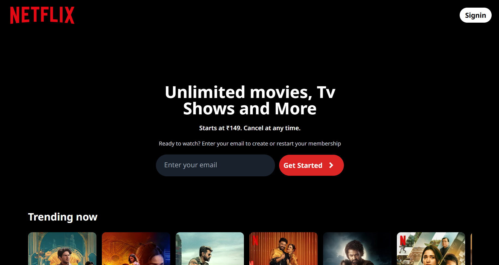
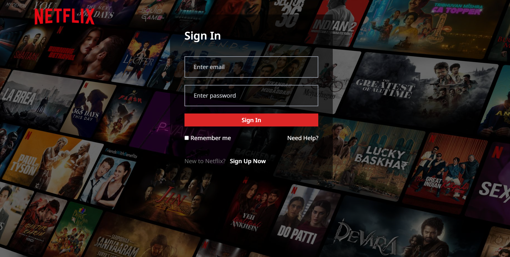
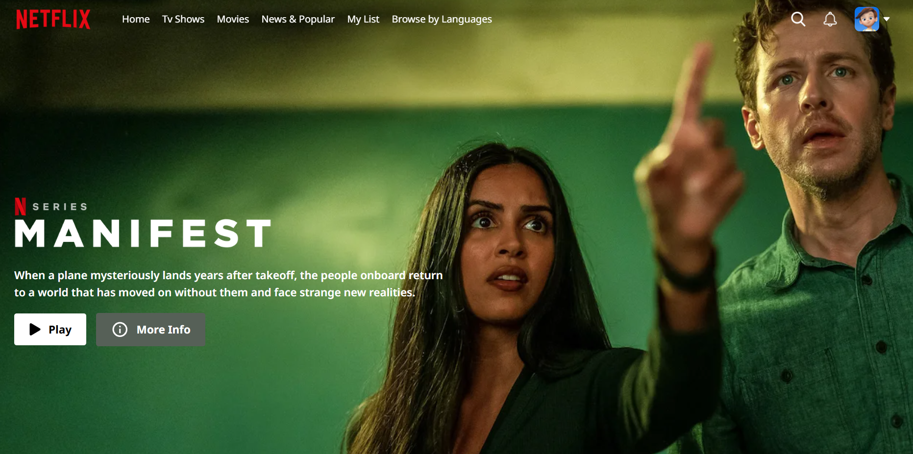

# 🎬 Netflix Clone 🎥  

A small **Netflix UI clone** built using **React.js**, **Tailwind CSS**, and **Firebase** for a seamless login and signup experience. 🚀  

🔗 **Live Preview**: [Click here to see the app in action!](https://netflix-gamma-peach-44.vercel.app/)  

## ✨ Features  

- 🔑 **User Authentication**: Secure signup and login powered by Firebase.  
- 🎨 **Modern UI Design**: Styled with Tailwind CSS for a sleek and elegant interface.  
- 📄 **Static Content**: Mimics the Netflix homepage with sample movie tiles.  

## 🖼️ Screenshots  

### 1️⃣ Homepage  
  

### 2️⃣ Login  
  

### 3️⃣ Main Page  
  

## 🛠️ Technologies Used  

- ⚛️ **React.js**: Frontend framework for building the app.  
- 🎨 **Tailwind CSS**: Utility-first CSS framework for beautiful designs.  
- 🔥 **Firebase**: Authentication backend for managing users.  

## 🚀 Getting Started  

Follow these steps to get the project up and running on your local machine:  

1. **Clone the repository**:  
   ```bash  
   git clone https://github.com/yourusername/netflix-clone.git  
   cd netflix-clone  
   ```  

2. **Install dependencies**:  
   ```bash  
   npm install  
   ```  

3. **Set up Firebase**:  
   - Create a Firebase project in the [Firebase Console](https://console.firebase.google.com/).  
   - Enable **Authentication** with Email/Password.  
   - Copy the Firebase configuration and add it to a `.env` file in the root directory:  
     ```env  
     REACT_APP_FIREBASE_API_KEY=your_api_key  
     REACT_APP_FIREBASE_AUTH_DOMAIN=your_auth_domain  
     REACT_APP_FIREBASE_PROJECT_ID=your_project_id  
     REACT_APP_FIREBASE_STORAGE_BUCKET=your_storage_bucket  
     REACT_APP_FIREBASE_MESSAGING_SENDER_ID=your_messaging_sender_id  
     REACT_APP_FIREBASE_APP_ID=your_app_id  
     ```  

4. **Start the development server**:  
   ```bash  
   npm run dev  
   ```  

5. Open the app in your browser at [http://localhost:3000](http://localhost:3000). 🌟  


